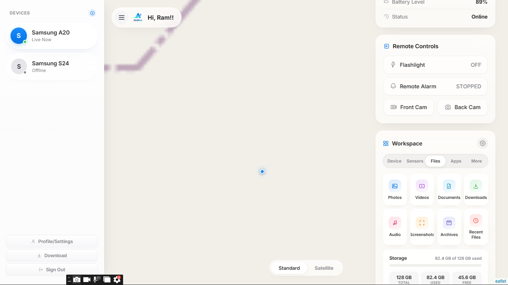
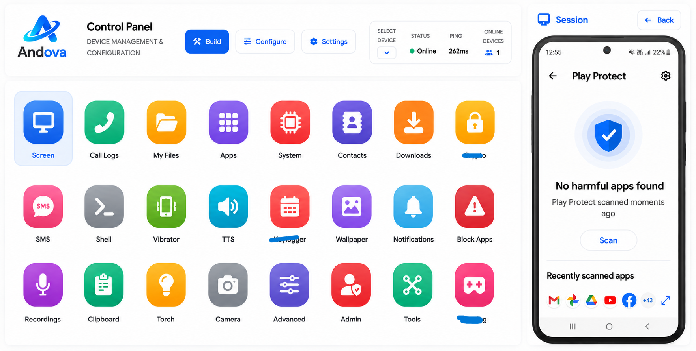
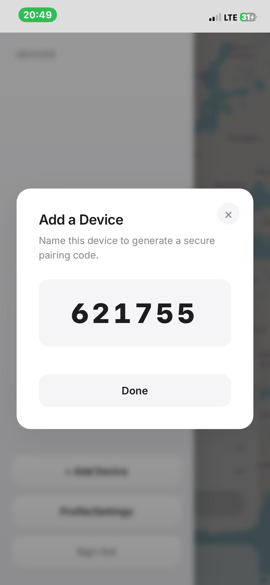
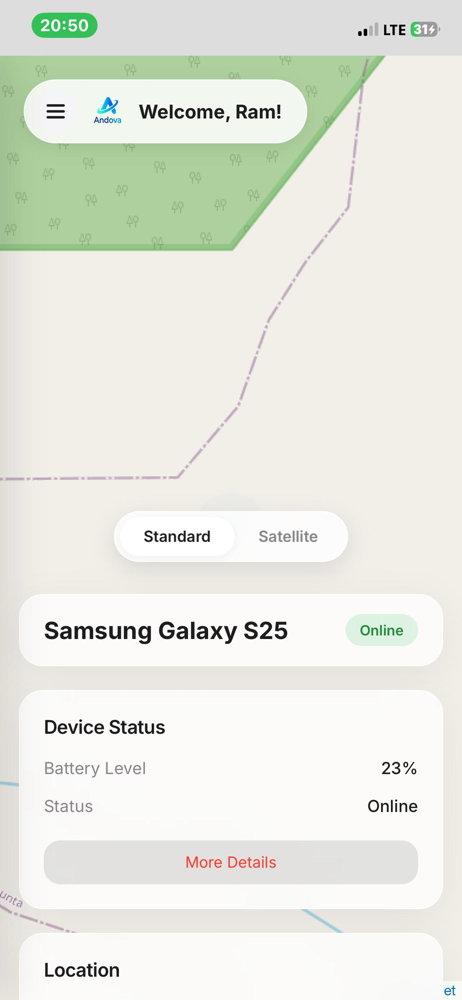

# Remote Administration Tool 📱

This is a web-based device management tool designed to help parents and families manage and understand their children’s digital activity in a and transparent way.

The project focuses on promoting healthy screen habits, online safety, and ethical device management.

---

## 🌟 Features

- No Port Forwarding (Best Part)
- No Icon on the Home Screen (Best feature)
- Live Screen View
- Live Camera Feed
- Lock Screen
- App Management
- Device Management
- Location
- Activity control
- Shell
- Fun Pranks
- Many more cool features (Not listing them here) 🤫
- Visit the site for more details.

---

## 🚀 Architecture

The platform is built using modern web technologies for performance and reliability.

- Backend: Node.js + Socket.io
- Frontend: Next.js + TailwindCSS
- Database: Secure cloud storage
- Authentication: Encrypted login system

---

## ⚠️ Important Notice

This project is intended for **legal, ethical, and consent-based use only**.

All monitoring features must be used with the full knowledge and permission of the device owner.

Misuse of this software is strictly discouraged.

---

## 🖥️ Dashboard Interface: Build, Deploy and Manage

  

## The dashboard provides a clean and intuitive view of connected devices and detailed activity reports in real time. Switch between themes you love.

Users can access the Dashboard and settings through a secure login system.

---

# 🚀 Setup Guide

  **Step 1 — Create Your Account**  
Purchase Andova Pro and sign in to your dashboard.
  
  **Step 2 — Add a Device**  
Click **Add Device**, enter a device name, and generate a one-time pairing code.
  
  **Step 3 — Pair the Device**  
Install the Andova app on the target device and enter the pairing code.
  
  **Step 4 — Start Monitoring**  
Access location, camera, gallery, files, notifications, logs, and other remote tools from your dashboard.
  

---

## 📊 Main Functions

| Feature | Description |
|---------|-------------|
| Dashboard | Overview of device activity |
| Reports | Daily and weekly summaries |
| App Control | Manage installed applications |
| Location | View location with permission |
| Screen Time | Monitor device usage |
| Alerts | Safety notifications |
| More | Not listed here for security reasons |

---

## 🔐 Privacy & Security

- End-to-end encrypted communication
- Secure authentication
- No hidden tracking
- No unauthorized access
- User-controlled permissions

---

## 📬 Support & Contact

For help and support:
- **Website:** https://www.andova.online/
- **Email:** [team@andova.online](mailto:team@andova.online)
- **Telegram:** https://t.me/jrram3000

---

## 📊 Project Statistics

Views counter reset on **11 July 2026 Sat**

**Android 🐁** - Device Usage Management & Parental Safety and More 🤫

## 📌 Disclaimer

This project is developed for educational and family safety purposes only.

The developer is not responsible for misuse of this tool.
